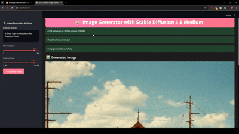
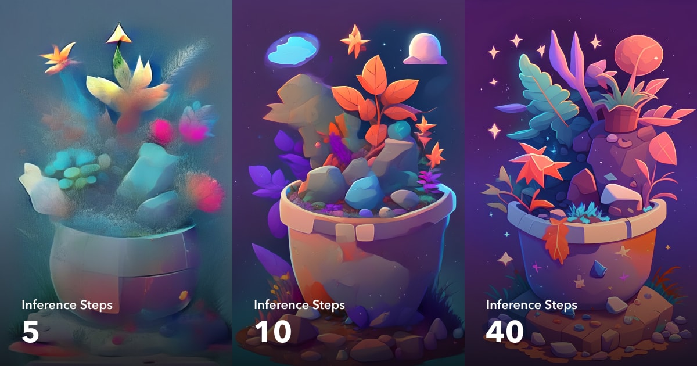
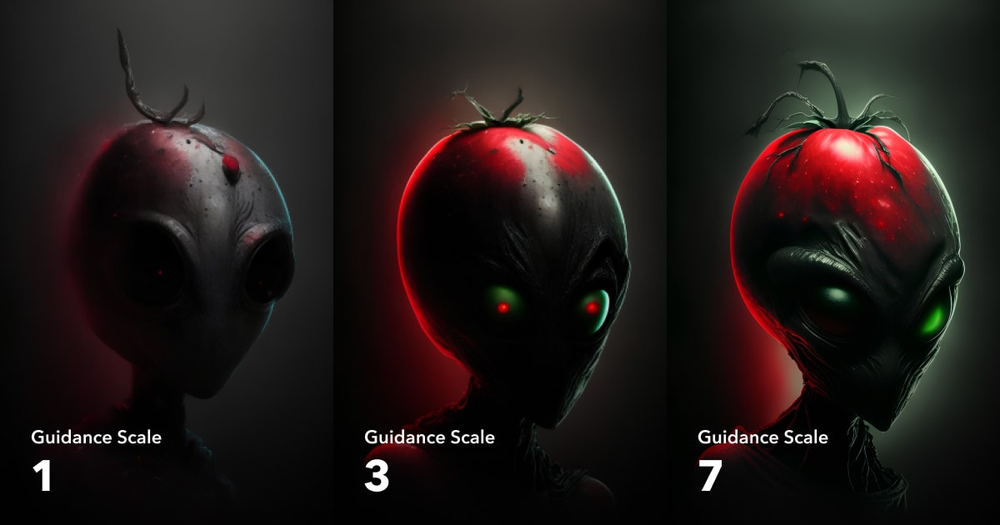

# Image Generation App with Stable Diffusion 3.5 Medium



I used the prompt - " A Ghost Town in the style of a Wes Anderson movie"

## Table of Contents
- [Project Description](#project-description)
- [Use Cases](#use-cases)
- [Understanding Diffusion Models](#understanding-diffusion-models)
- [Technical Implementation](#technical-implementation)
  - [Dependencies](#dependencies)
  - [System Requirements](#system-requirements)
- [Parameter Guide](#parameter-guide)
  - [Inference Steps](#1-inference-steps-num_inference_steps)
  - [Guidance Scale](#2-guidance-scale-guidance_scale)
- [Installation Guide](#installation-guide)
  - [Local Installation](#local-installation)
  - [Docker Installation](#docker-installation)
- [Usage Guide](#usage-guide)
- [Error Handling](#error-handling)
- [Performance Optimization](#performance-optimization)
- [Contributing](#contributing)
- [License](#license)

## Project Description

This application is a Streamlit-based web interface that leverages the Stable Diffusion 3.5 Medium model to generate high-quality images from text descriptions. It features an intuitive user interface with customizable generation parameters and optimized performance through CUDA acceleration and model quantization.

⚠️ **Important**: This application requires an NVIDIA GPU with CUDA support. CPU-only execution is not recommended due to significantly slower performance.

## Use Cases

This image generation tool is particularly valuable for:

1. **Digital Art Background Creation**
   - Generate unique backgrounds for digital paintings
   - Create atmospheric environments for character art
   - Design abstract textures for graphic design

2. **Creative Inspiration**
   - Explore different artistic styles by adjusting parameters
   - Generate concept art for projects
   - Experiment with various visual themes and moods

3. **Iterative Design**
   - Test different variations of the same concept
   - Rapidly prototype visual ideas
   - Fine-tune images through parameter adjustment

4. **Art Direction Research**
   - Explore color palettes and compositions
   - Generate mood boards
   - Visualize different artistic directions

## Understanding Diffusion Models

Stable Diffusion belongs to a class of deep learning models called diffusion models. Here's how they work:

### The Diffusion Process

1. **Forward Diffusion**
   - Starts with a clear image
   - Gradually adds random noise in small steps
   - Eventually transforms the image into pure noise

2. **Reverse Diffusion (Generation)**
   - Begins with random noise
   - Learns to gradually remove noise
   - Guided by the text prompt to create meaningful images

### Key Components

- **U-Net Architecture**: Forms the backbone of the model, learning to denoise images
- **Text Encoder**: Processes text prompts into embeddings that guide image generation
- **Noise Scheduler**: Controls the noise addition/removal process

### Why It Works

- The model learns the statistical patterns of how images decompose into noise
- During generation, it reverses this process while being conditioned on text
- This allows for both creativity and control in the generation process

## Technical Implementation

### Dependencies

The application requires the following key packages:
- `torch`: For deep learning operations
- `streamlit`: For the web interface
- `diffusers`: For the Stable Diffusion pipeline
- `transformers`: For model handling
- `accelerate`: For optimization
- `safetensors`: For model weight handling

### System Requirements

- CUDA-capable GPU (recommended)
- Python 3.8 or higher
- Minimum 8GB RAM (16GB recommended)
- 2GB free disk space for model storage

## Parameter Guide

### 1. Inference Steps (`num_inference_steps`)

The inference steps parameter controls the denoising process during image generation.

#### Technical Details:
- **Range**: 1-50 steps
- **Default**: 40 steps
- **Impact on Generation**:
  - Lower steps (1-20): Faster generation but lower quality
  - Medium steps (20-40): Good balance of speed and quality
  - Higher steps (40-50): Highest quality but diminishing returns



#### Recommended Settings:
- Quick drafts: 20 steps
- Standard use: 30-40 steps
- High-quality renders: 50 steps

### 2. Guidance Scale (`guidance_scale`)

The guidance scale determines how closely the generated image follows the input prompt.

#### Technical Details:
- **Range**: 1.0-10.0
- **Default**: 4.5
- **Impact on Generation**:
  - Low (1.0-3.5): More creative, less prompt-adherent
  - Medium (4.0-8.0): Balanced interpretation
  - High (8.0-10.0): Strict prompt adherence



#### Recommended Settings:
- Abstract concepts: 3.0-4.0
- General use: 4.5-7.0
- Precise generations: 7.0-8.0

## Installation Guide

### Local Installation

1. Clone the repository:
   ```bash
   git clone <repository-url>
   cd image-generation-app
   ```

2. Create and activate a virtual environment:

   Windows (PowerShell):
   ```powershell
   python -m venv virt_env
   Set-ExecutionPolicy -ExecutionPolicy RemoteSigned -Scope Process
   .\virt_env\Scripts\Activate.ps1
   ```

   Linux/MacOS:
   ```bash
   python -m venv virt_env
   source virt_env/bin/activate
   ```

3. Install dependencies:
   ```bash
   pip install -r requirements.txt
   ```

4. Run the application:
   ```bash
   streamlit run app.py
   ```

### Docker Installation

1. Build the Docker image:
   ```bash
   docker build -t image_gen_app .
   ```

2. Run the container:
   ```bash
   # Windows (PowerShell)
   docker run -d --gpus all -v "${env:USERPROFILE}\.cache\huggingface:/app/cache" -p 8501:8501 image_gen_app

   # Linux/MacOS
   docker run -d --gpus all -v ~/.cache/huggingface:/app/cache -p 8501:8501 image_gen_app
   ```

## Usage Guide

1. Access the web interface:
   - Open your browser and navigate to `http://localhost:8501`

2. Generate images:
   - Enter your text prompt in the sidebar
   - Adjust inference steps and guidance scale as needed
   - Click "Generate Image"
   - Download the generated image using the download button

## Error Handling

The application includes comprehensive error handling:
- Dependency validation
- CUDA availability checking
- Model loading verification
- Generation process monitoring

Common error messages and solutions:
- CUDA not available: Check GPU drivers and CUDA installation
- Memory errors: Reduce batch size or model precision
- Loading errors: Check internet connection and model cache

## Performance Optimization

The application implements several optimization techniques:
- 4-bit quantization using `BitsAndBytesConfig`
- CPU offloading for memory management
- CUDA synchronization for GPU operations
- Garbage collection during initialization

## Contributing

Contributions are welcome! Please follow these steps:
1. Fork the repository
2. Create a feature branch
3. Commit your changes
4. Push to your branch
5. Create a Pull Request
